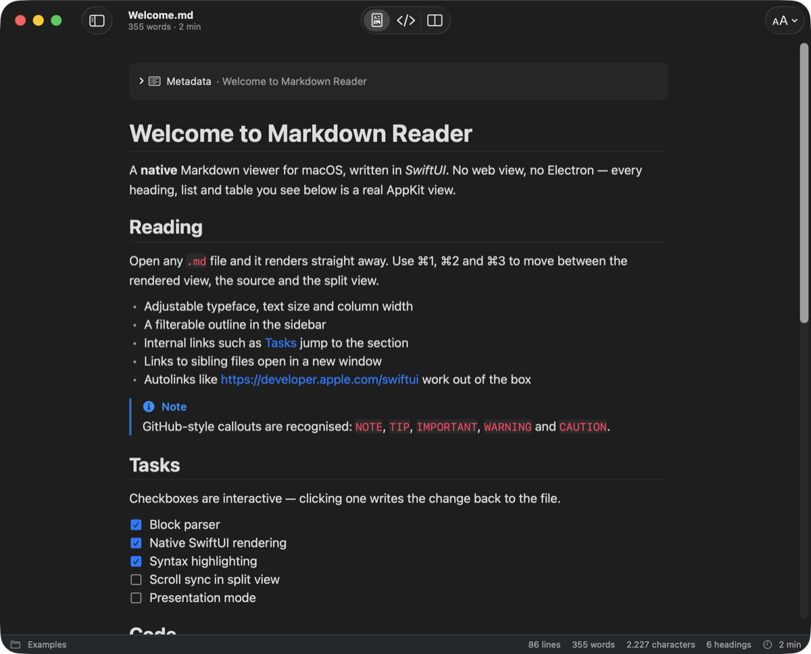
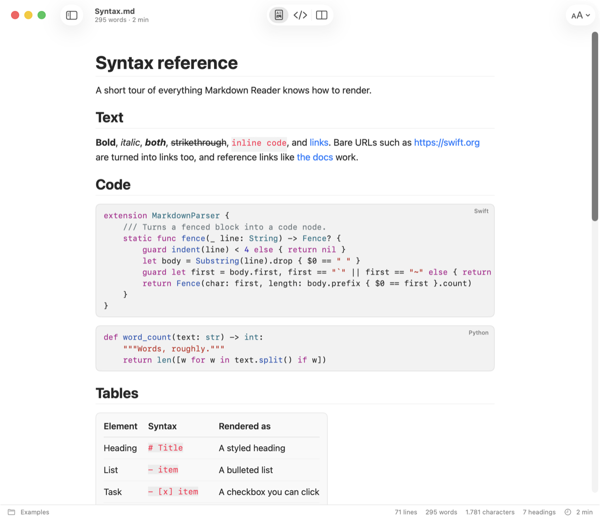
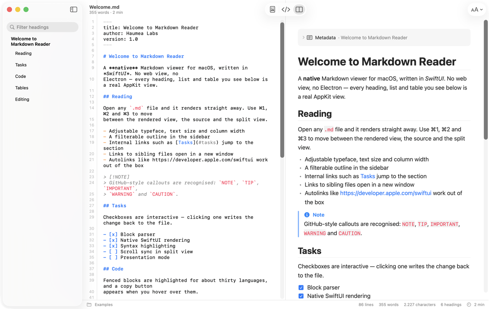
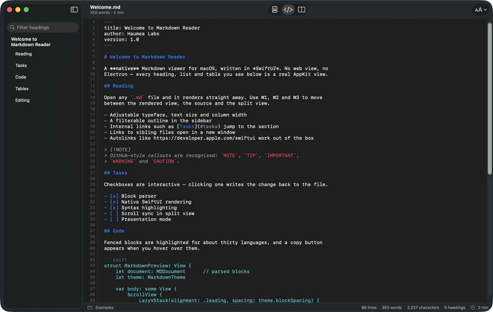
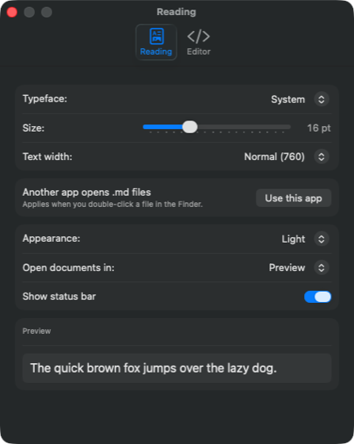

# Markdown Reader

A native Markdown viewer for macOS, written in SwiftUI. It is built for
**reading**: double-click a `.md` file and it opens rendered, with the source
one keystroke away when you actually need to edit something.

No web view, no Electron, no bundled JavaScript. Every heading, list, table and
code block on screen is a real AppKit view.



## Features

### Reading

- **Native rendering** of headings (ATX and Setext), nested lists, task lists,
  tables with column alignment, block quotes, fenced and indented code, images,
  thematic breaks, YAML front matter and reference links.
- **GitHub-style callouts** — `> [!NOTE]`, `TIP`, `IMPORTANT`, `WARNING`,
  `CAUTION` — rendered with their own icon and colour.
- **Syntax highlighting** in fenced code blocks for over 60 language tags, plus
  a hover-to-copy button on every block.
- **Outline sidebar** with a filter field; picking a heading scrolls the
  rendered view, or jumps the caret to that line in the source view.
- **Working links**: `#anchor` links scroll to the heading, links to sibling
  `.md` files open in a new window, bare URLs are auto-linked, and everything
  else goes to your browser.
- **Interactive checkboxes**: ticking a task in the rendered view rewrites that
  line in the file.
- **Reading controls** — typeface (system, serif, rounded, monospaced), text
  size, column width, light/dark/automatic appearance — and a status bar with
  line, word and character counts plus an estimated reading time.

### Editing

- A real text editor built on `NSTextView`: line numbers, Markdown syntax
  highlighting, soft wrap and the system find bar (⌘F).
- Smart quotes, dash substitution and text replacement are **switched off** —
  they silently corrupt Markdown files.
- Standard document behaviour: ⌘S, autosave, Versions and Revert To all come
  from the system's document machinery.
- Split view keeps the rendered output in sync as you type (parsing is
  debounced, so typing stays smooth in long documents).

### Around the app

- **Export as HTML** — a self-contained file with light and dark styles — or
  **Copy as HTML** for pasting into another app.
- **Localised** in 43 languages (ar, be, bg, bs, ca, cs, da, de, el, en, es, et,
  eu, fi, fr, ga, gl, hi, hr, hu, is, it, ja, lb, lt, lv, mk, mt, nb, nl, pl,
  pt-BR, pt-PT, ro, ru, sk, sl, sq, sr, sv, tr, uk, zh-Hans); the app follows
  your system language.
- Opens `.md`, `.markdown`, `.mdown`, `.mkd`, `.mkdn`, `.mdwn`, `.mdtxt`,
  `.mdtext`, `.qmd` and `.rmd`, and registers as an alternate handler for plain
  text.
- Reads UTF-8 and falls back to Latin-1, strips a leading BOM, normalises CRLF,
  and writes the file back in its original encoding.

## Screenshots

| Syntax | Split view |
|:------:|:----------:|
|  |  |

The source view, with line numbers, Markdown highlighting and the outline:



Settings (⌘,):



## Installation

Requirements: **macOS 14** or later to run, Xcode 16 (Swift 6 toolchain) or
later to build.

```bash
git clone <this repo> && cd MarkdownReader
./Scripts/build_app.sh --install
```

That compiles in release mode, assembles `Markdown Reader.app`, generates the
icon, signs it ad-hoc and copies it to `/Applications`. Without `--install` the
bundle is left in `build/`. Other flags: `--debug`, `--universal` (arm64 +
x86_64).

### Making it the default app for `.md`

From the app: **Markdown Reader › Open .md files with Markdown Reader**, or the
*Use this app* button in Settings. From the Finder: right-click any `.md` file →
Get Info → *Open with* → Markdown Reader → *Change All*.

> [!NOTE]
> Install the app in `/Applications` before making it the default. If the
> bundle lives on an external volume, the association breaks as soon as that
> volume is unmounted.

## Keyboard shortcuts

| Action | Shortcut |
|:-------|:---------|
| Rendered view | ⌘1 |
| Source code | ⌘2 |
| Split view | ⌘3 |
| Show/hide outline | ⌃⌘S |
| Bigger / smaller text | ⌘+ / ⌘− |
| Actual text size | ⌘0 |
| Find in source | ⌘F |
| Save | ⌘S |
| Reveal in Finder | ⇧⌘R |
| Settings | ⌘, |

## Supported syntax

| Element | Notes |
|:--------|:------|
| Headings | ATX (`#`) and Setext (`===`, `---`), with anchors derived from the text |
| Emphasis | Bold, italic, strikethrough, inline code |
| Lists | Ordered, unordered, arbitrarily nested, tight and loose spacing |
| Task lists | `- [ ]` / `- [x]`, clickable in the rendered view |
| Code | Fenced with a language hint, and 4-space indented |
| Tables | GFM pipe tables, with `:---`, `:---:` and `---:` alignment |
| Quotes | Nested blocks inside, plus GitHub callouts |
| Links | Inline, reference, autolinks, internal anchors, relative file paths |
| Images | Remote (`http`), absolute and document-relative paths |
| Front matter | YAML between `---` fences, shown as a collapsible metadata box |
| HTML | `` becomes an image; other tags are stripped and the text is kept |

Not supported yet: footnotes, definition lists, math, Mermaid diagrams and
arbitrary inline HTML.

## How it works

```
Sources/MarkdownReader/
  App/        entry point, menu commands, settings, default-app registration
  Model/      the FileDocument and the block parser
  Render/     typography, inline styling, code syntax highlighting
  Views/      rendered view, source editor, outline sidebar
  Export/     HTML serialisation
AppResources/ Info.plist (document types), icon, .lproj strings
Scripts/      build_app.sh and the icon generator
Examples/     sample documents
Tests/        parser, document and export tests
```

Parsing happens in two layers. `MarkdownParser` resolves **block** structure —
the part Foundation does not expose — into a tree of `MDBlock` values, keeping
the source line number of every node so the outline and the task checkboxes can
map back to the file. **Inline** markup is handed to Foundation's own Markdown
parser inside `InlineRenderer`, which then resolves reference links, detects
bare URLs with `NSDataDetector` and applies the visual style run by run.

The rendered view is a `LazyVStack`, so only the visible blocks are built.
Parsed inline strings and highlighted code blocks are cached in `NSCache`, and
in split view the document is re-parsed off the main actor with a short debounce.

The source editor is a TextKit 1 `NSTextView` wrapped in `NSViewRepresentable`,
with a custom `NSRulerView` for line numbers and an `NSTextStorage` pass that
styles the Markdown itself.

## Development

```bash
swift build            # compile
swift test             # 24 tests: parser, document round-trip, HTML export
./Scripts/build_app.sh # build the .app bundle in build/
```

The package builds a plain executable; `Scripts/build_app.sh` is what turns it
into a bundle — it copies `Info.plist`, the icon and the `.lproj` folders into
`Markdown Reader.app`, signs it and registers it with Launch Services. The icon
itself is generated by `Scripts/make_icon.swift` (Core Graphics, no image
assets), so it is not checked in.

**Adding a language to the highlighter**: add a `case` to `spec(for:)` in
`Render/CodeHighlighter.swift` with its comment markers, quote characters and
keyword set.

**Adding a translation**: copy `AppResources/en.lproj/Localizable.strings` to
`AppResources/<code>.lproj/`, translate the values, and add the language code to
`CFBundleLocalizations` in `AppResources/Info.plist`. The build script picks up
any `.lproj` folder automatically.

## Roadmap

- Scroll sync between the editor and the preview
- Printing and PDF export
- Footnotes and math
- A presentation mode for reading long documents
